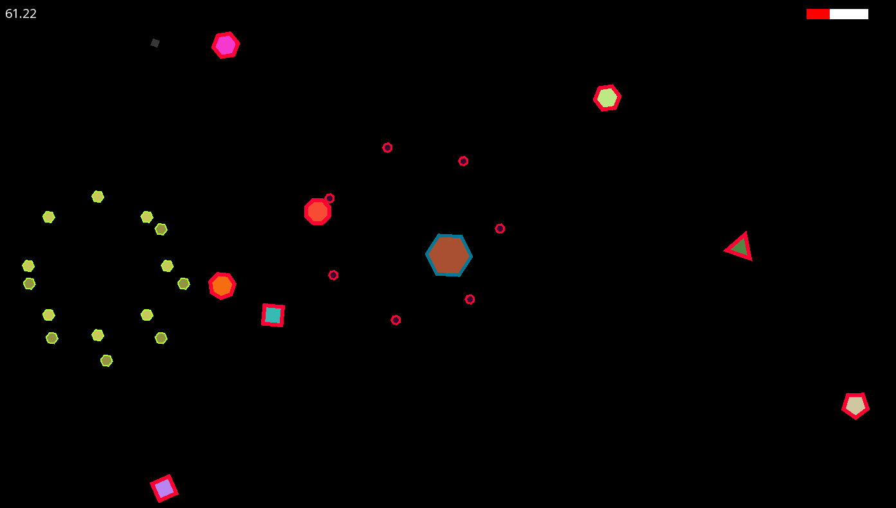

# Geometry Game



### NOTES:

- Developed using CMake version 3.30 on Windows 10
- Compiler used: mingw64
- The game uses SFML version 2.6.1

### Build
```
`mkdir external`

git clone --branch 2.6.1 https://github.com/SFML/SFML.git external

cmake -DCMAKE_BUILD_TYPE:STRING=Debug -DCMAKE_EXPORT_COMPILE_COMMANDS:BOOL=TRUE -DCMAKE_C_COMPILER:FILEPATH=[gcc.exe bin path] -DCMAKE_CXX_COMPILER:FILEPATH=[g++.exe bin path] --no-warn-unused-cli -S[project dir path] -B[build dir path] -G "MinGW Makefiles"

cmake --build [build dir name] --config Debug --target all -j 10 --
```

Then run the executable in the build directory
